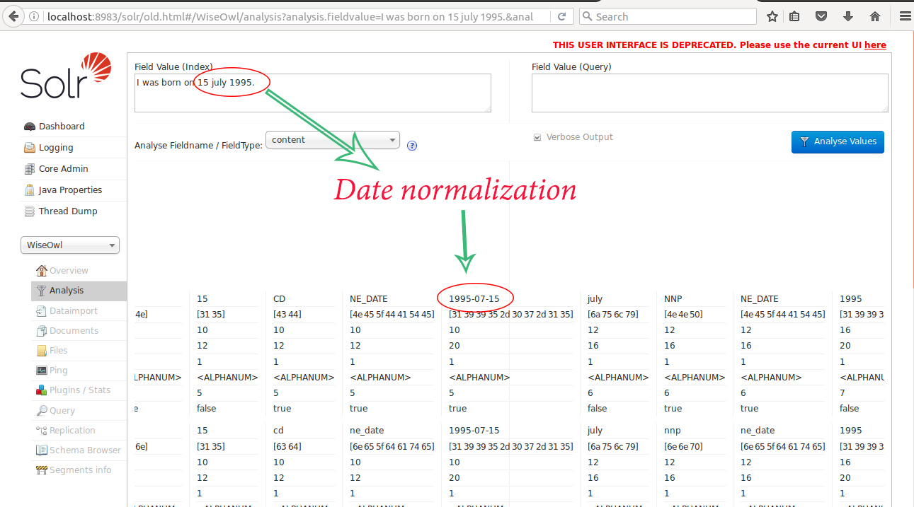
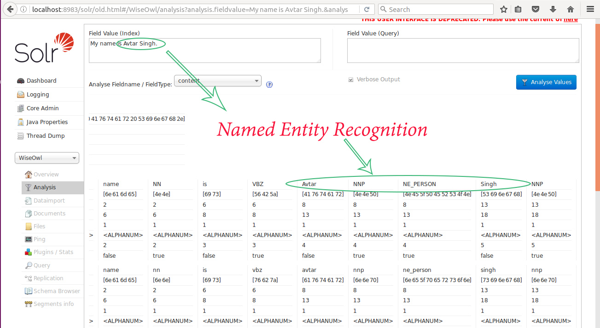

# WiseOwl 
_This is a Fact based Question Answering System using Apache Solr as backend search engine, Wikipedia dumps as information source, Apache velocity , Html, Css for Web interface Design. The project also uses Linux bash script to perform its various functions like start,stop,training and indexing_

## Features:
* Fast and reliable searching using open source Apache Solr 6.3.0 and Apache Lucene 6.3.0 projects. Apache Solr is used as a search engine which uses capabilities of Apache Lucene to profide searching.
* Custom-made Query Parser based on Apache Lucene 6.3.0 specially optimized for Question Answering.
* Named Entity Recognition and Time normalization during indexing using StanfordCoreNLP.
* Automatic cleaning and parsing of Wikipedia Raw text from the wikipedia dumps. It is achieved by using Lucene 6.3 benchmark classes and WikiClean Project.
* Answer Type Classification of given question using Apache OpenNLP's Maxent Models, Models are trained on data taken from thesis by Tom Morton, tagging aroung 1800 handnpicked questions. 
* Currently the project is more optimised for Description Type Answers.
* Sleek user interface by combining elements of css, html and Apache Velocity.
* Bash script which uses underlying solr scripts to provide functionality of starting, stoping, indexing and training.

## Installation 
Throughout this document, WiseOwl_HOME is the base directory for all the wiseowl code
### Required Downloads 
-----------------------------------------------------------------------------------------------------------------------
Throughout this document, WiseOwl_HOME is the base directory for all the wiseowl code

WiseOwl uses Maven for building and running the code.  To get
started, you will need:

1. JDK 1.7+ 
2. Maven 3.0 or higher installed
3. The OpenNLP English models, available at 
   http://opennlp.sourceforge.net/models-1.5/
   
   Download all the models, and place the in WiseOwl_HOME/opennlp-models
   place ans.bin model from the repository to WiseOwl_HOME/opennlp-models/qa
   

4. Get WordNet 3.0 and place it in the WiseOwl_HOME root directory.
   (usually it comes as zipped file, so unzip it using gunzip or other utilities)
   You may find it at the given link or perform a simple google search to find it.
   http://wordnetcode.princeton.edu/3.0/WordNet-3.0.tar.gz
   
5. Download Apache Solr 6.3.0 available at
   http://lucene.apache.org/solr/
   copy contrib, server and dist folder from Solr 6.3.0 package to WiseOwl_HOME root directory

## Building the Source
----------------------------------------------

Prior to building the source, for those previously unfamiliar with Maven,
it may be wise to read this to avoid future hassles:
http://maven.apache.org/guides/getting-started/maven-in-five-minutes.html

To build the source, in WiseOwl_HOME:

   mvn clean package 

## Running the System
--------------------
1. Goto the WiseOwl_HOME/bin directory and open a terminal there.
  type : 
 * ./WiseOwl        : For different options available 
 * ./WiseOwl start  : To start the Apache Solr Server
 * ./WiseOwl stop   : To stop the server
2. Point your web browser to 
   http://localhost:8983/solr/WiseOwl/answer
   
   You will see a screen similar to a screen below.
 

